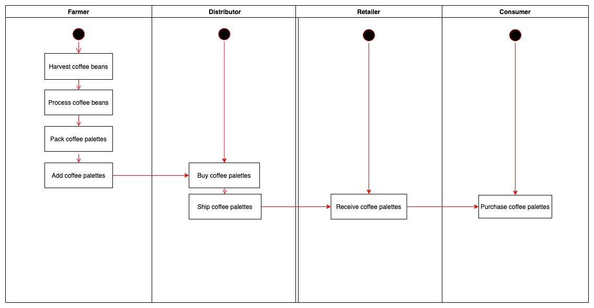

# Project 6 Supply Chain

## Truffle Version
>
    Truffle v5.3.2 (core: 5.3.2)
>

## Node Version
>
    Node v14.15.5
>

## web3 Version
>
    Web3.js v1.3.5
>
## Contract Address
>
    0x5526C3FfeE7CB5755619EB9a4609Ad15F9Db1ba1 
>

## Transaction ID
>
    0xb173978929cae6d8c6ff5cd32b69205ce0bb2c29f22f468cf9aaec6bcf106ab8
>

## Project write-up - UML

### Activity Diagram


### Sequence Diagram


### State Diagram


### Class Diagram (Data Model)


## Requirement: Project write-up - Libraries
Library called Roles was used to made it easier to manage access control. It made it easy to add and remove roles in each of my contracts. Web3 is used to allow us to interact with local/remote ethereum node using HTTP, IPC or WebSocket. Truffle framework was used for smart contract compilation, testing, deployment and migration.

## Getting Started

These instructions will get you a copy of the project up and running on your local machine for development and testing purposes.

### Prerequisites

Please make sure you've already installed ganache-cli, Truffle and enabled MetaMask extension in your browser.

### Installing

A step by step series of examples that tell you have to get a development env running

Clone the repository


Change directory to ```project-6``` folder and install all required npm packages (as listed in ```package.json```):

```
cd project-6
npm install
```

Launch Ganache:

```
ganache-cli -m "spirit supply whale amount human item harsh scare congress discover talent hamster"
```

In a separate terminal window, Compile smart contracts:

```
truffle compile
```

This will create the smart contract artifacts in folder ```build\contracts```.

Migrate smart contracts to the locally running blockchain, ganache-cli:

```
truffle migrate
```

Test smart contracts:

```
truffle test
```

All 10 tests should pass.

In a separate terminal window, launch the DApp:

```
npm run dev
```